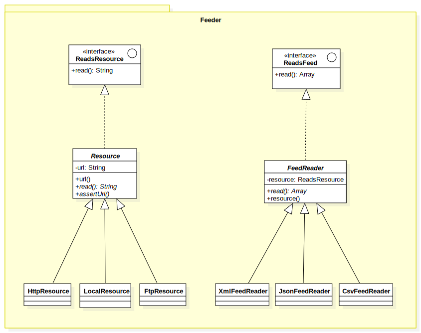

# Feeder
  
Read feed from local, http in different formats xml, csv, (json)

**Class Diagram**

### Installation

`composer require amelendres/feeder`

### Example

**Read CSV feeds from local**

`bin/import glorf`

**Read XML feeds from Http**

### How to extend

You can extend or contribute this library adding more Resources and FeedReaders formats.

