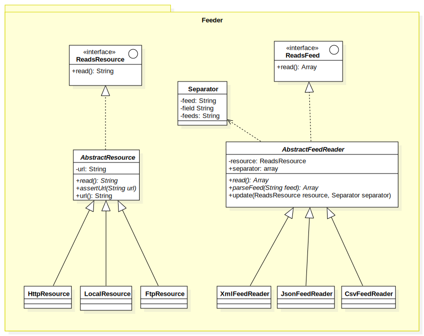

# Feeder
  
Read feed from local, http in different formats xml, csv, (json)

**Class Diagram**



### Installation

`composer require amelendres/feeder`


### Example

**Read CSV feeds from local**

```
$resource = new LocalResource('/absolute/path/to/csv/file');
$feedReader = new CsvFeedReader($resource);
$feedReader->read(); 
```

**Read XML feeds from Http**

```
$resource = new HttpResource('http://url.com/feed/xml');
$feedReader = new XmlFeedReader($resource);
$feedReader->read(); 
```


### How to extend

You can extend or contribute this library adding more Resources and FeedReaders formats.

