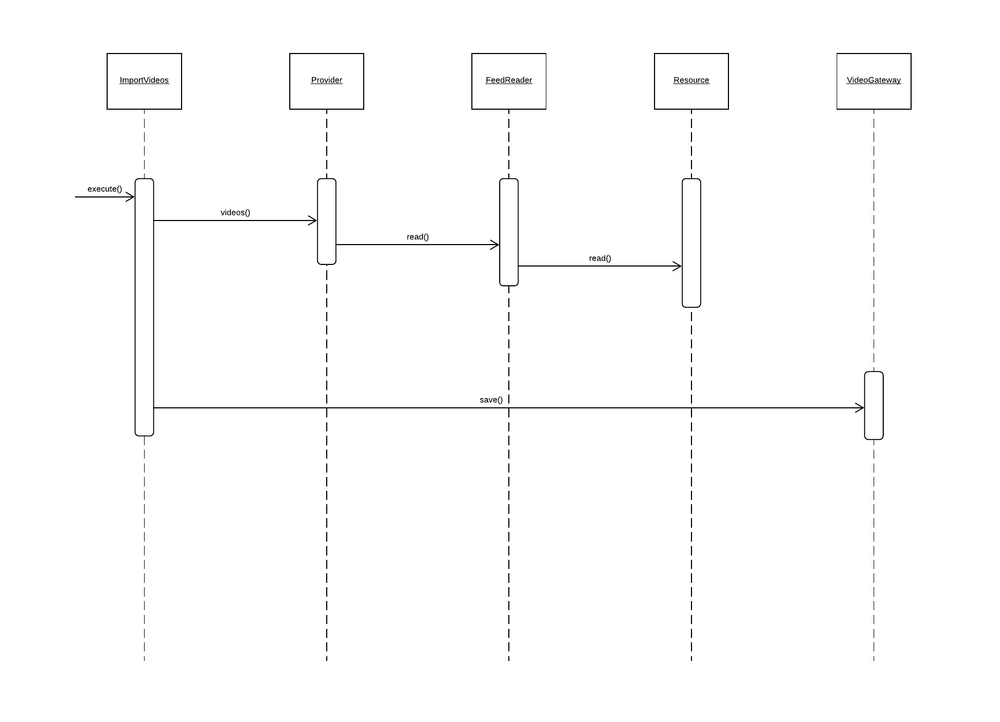

# Feed Importer (Video)

We buy videos from several sources.  Each source provides its content to us in a different format.
Write a command line script to import the videos.    

**Layers - Class Diagram**

**Import Videos - Sequence Diagram**

### Installation

`composer install`

### How to run:

**Import**

`bin/import glorf`

**Tests**

`./vendor/bin/codecept run`

### Where to find the code

Go to `src` directory 

### TODO Improvements

* Save the videos through Queue-Worker depending on demand
* Add Domain Value Objects: VideoId, Url, Tag ...
